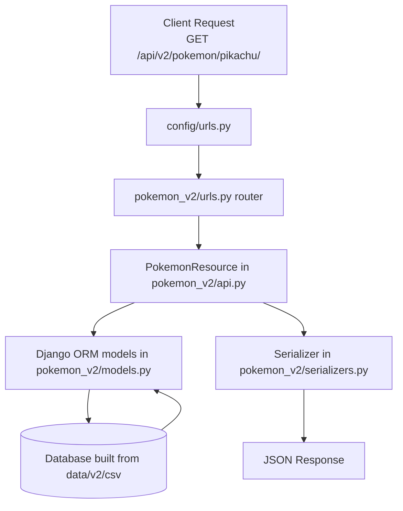

# PokeAPI Onboarding

## Repository Purpose

This repository powers PokeAPI, a Django-based API service that exposes Pokemon data through:

- REST endpoints under `api/v2`
- GraphQL endpoints through Hasura metadata/config in `graphql/`

It also contains the source CSV dataset and build scripts used to populate the database.

## Structure Overview

- `pokemon_v2/`: Core Django app with API viewsets, serializers, models, and URL routing.
- `config/`: Django settings modules (`local`, `docker-compose`, base settings, URL root, WSGI).
- `data/v2/csv/`: Canonical Pokemon dataset used to build the DB.
- `data/v2/build.py`: Database loading logic from CSV files.
- `graphql/v1beta` and `graphql/v1beta2`: Hasura metadata and GraphQL examples.
- `Resources/`: Operational assets (Docker, Kubernetes, scripts, nginx, deployment helpers).
- `Makefile`: Main task runner for local setup, DB build, Docker flows, and GraphQL metadata apply.

## Beginner-Friendly Example

Use the built-in REST endpoint for Pokemon details:

- Endpoint: `/api/v2/pokemon/<id-or-name>/`
- Example: `/api/v2/pokemon/pikachu/`

Why this is a good first example:

- It is easy to call from browser or curl.
- It touches the core API routing and viewset pattern.
- It shows how this repository serves real data from the local database.

## Step-by-Step Walkthrough

1. Install dependencies:
   - `make install`
2. Apply migrations:
   - `make setup`
3. Build database from CSV files:
   - `make build-db`
4. Start server:
   - `make serve`
5. Open the API root:
   - `http://localhost:8000/api/v2/`
6. Call the beginner endpoint:
   - `http://localhost:8000/api/v2/pokemon/pikachu/`
7. Inspect where routing is defined:
   - Root include: `config/urls.py`
   - API routes registration: `pokemon_v2/urls.py`
   - Resource implementation pattern: `pokemon_v2/api.py`

## Mermaid Diagram

## Quick Start Next Steps

1. Run one GraphQL example from `graphql/v1beta2/examples/` after `make hasura-apply`.
2. Read `pokemon_v2/api.py` to understand the shared `PokeapiCommonViewset` behavior.
3. Trace one model end-to-end: CSV file -> DB table -> model -> serializer -> REST output.
